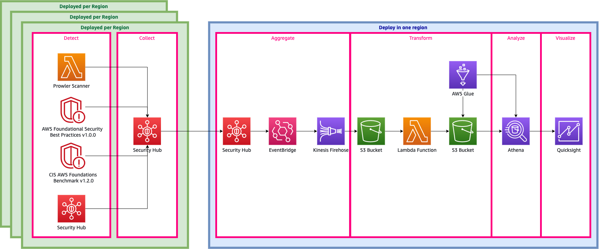

## AWS Security Hub Analytic Pipeline

[AWS Security Hub](https://aws.amazon.com/security-hub/) is a service that gives you aggregated visibility into your security and compliance posture across multiple AWS accounts. By exporting findings to Athena, you can enrich the data up with additional sources such as your configuration management database (CMDB) or IT service management database.  Additionally, you can build analytic dimenions to find trends and patterns.  This code is part of an upcoming blog post (link TBA) on visualizing Security Hub Findings to senior leaders and decision-makers.

This repository contains a CDK stack that builds the following infrastructure



Essentially there are two CDK Stacks (in one CDK Application):
- A stack deployed per region containing Security Hub and handles the necessary infrastructure to stream findings to S3
- A stack deployed once containing all the infrastructure to transform raw findings and expose it with Athena.

Additionally, included in the CDK application is Serverless Prowler Scanner designed to quickly provide real-data to help you walk through the Athena and QuickSight pieces, 
by providing you with actual actionable data.

## Building the stack

Create a virtual environment

```bash
$ python3 -m venv .venv
$ source .venv/bin/activate
```

Install CDK dependencies

```bash
$ pip install -r requirements.txt
```

## Deploy the stack

```bash
$ cdk deploy
```

## Tested Use Case
- AWS native security services -- GuardDuty, Access Analyzer, Inspector
- Security Hub standards -- CIS Benchmark, PCI/DSS, AWS Security Best Practices
- Third Party Integrations -- Prowler

## Security

See [CONTRIBUTING](CONTRIBUTING.md#security-issue-notifications) for more information.

## License

This library is licensed under the MIT-0 License. See the LICENSE file.

