# Security Hub Analytic Pipeline

[AWS Security Hub](https://aws.amazon.com/security-hub/) is a service that gives you aggregated visibility into your security and compliance posture across multiple AWS accounts. By joining Security Hub with [Amazon QuickSight](https://aws.amazon.com/quicksight/) — a scalable, serverless, embeddable, machine learning-powered business intelligence (BI) service built for the cloud — your senior leaders and decision-makers can consume dashboards to empower data-driven decisions and ensure a secure fleet of AWS resources. In organizations that operate at cloud scale, being able to summarize and perform trending analysis is key to identifying and remediating problems early leading to overall success of the organization. Additionally, QuickSight dashboards can be embedded to provide leaders with single-panes of glass.

In this blog post, you will learn how to build an analytic pipeline of your Security Hub findings, consume the data via [Amazon Athena](https://aws.amazon.com/athena/), and visualize it via QuickSight using the following steps:  

* Deploy a CDK stack that builds all the infrastructure you need to get started. 
* Visualize the data via QuickSight. Included in the code for this blog post is a serverless [Prowler](https://github.com/toniblyx/prowler) scanner that automatically publishes to Security Hub. This scanner, along with the Security Hub Standards of [CIS AWS Foundations Benchmark controls](https://docs.aws.amazon.com/securityhub/latest/userguide/securityhub-cis-controls.html) and [AWS Foundational Security Best Practices Standard](https://docs.aws.amazon.com/securityhub/latest/userguide/securityhub-standards-fsbp.html), will create our findings.
* Finally, we’ll dive into best practices to secure QuickSight.

## Solution overview

Figure 1 shows the flow of events and a high level architecture diagram from end to end.

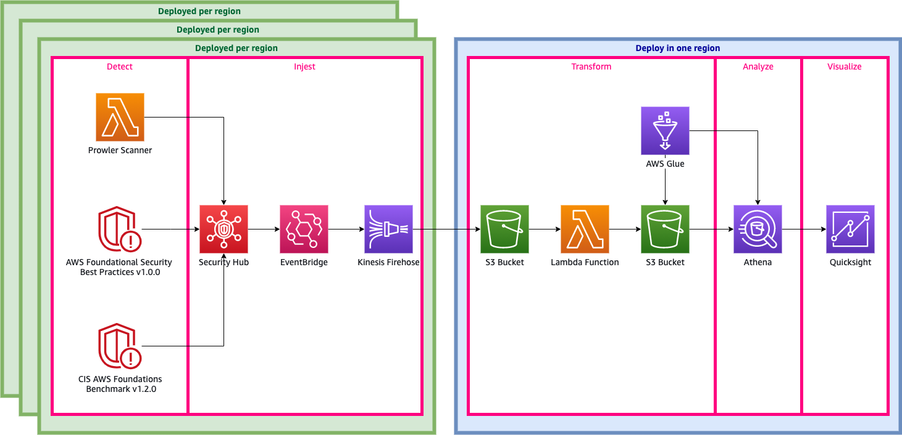
*Figure 1: High Level Architecture Diagram*

### Detect

AWS offers a number of tools to help detect security issues in real time. These fall into three types: [built in security standards](https://docs.aws.amazon.com/securityhub/latest/userguide/securityhub-standards.html), [other AWS services](https://docs.aws.amazon.com/securityhub/latest/userguide/securityhub-internal-providers.html), and [third-party partner products](https://docs.aws.amazon.com/securityhub/latest/userguide/securityhub-partner-providers.html). In this blog, we use two built-in security standards — [CIS AWS Foundations Benchmark controls](https://docs.aws.amazon.com/securityhub/latest/userguide/securityhub-cis-controls.html) and [AWS Foundational Security Best Practices Standard](https://docs.aws.amazon.com/securityhub/latest/userguide/securityhub-standards-fsbp.html) — and a serverless Prowler Scanner that acts as a third-party partner product.

### Ingest

Security Hub not only provides a comprehensive view of your security alerts and security posture across your AWS accounts; it also acts as a data sink for your security tools. Any tool that can expose data via [AWS Security Finding Format (ASFF)](https://docs.aws.amazon.com/securityhub/latest/userguide/securityhub-findings-format.html) can use the [BatchImportFindings](https://docs.aws.amazon.com/securityhub/1.0/APIReference/API_BatchImportFindings.html) API operation to push data into Security Hub. For more details, see: [using custom product integration to send findings to AWS Security Hub](https://docs.aws.amazon.com/securityhub/latest/userguide/securityhub-custom-providers.html) and [Available AWS service integrations](https://docs.aws.amazon.com/securityhub/latest/userguide/securityhub-internal-providers.html) in the [Security Hub User Guide](https://docs.aws.amazon.com/securityhub/latest/userguide).

### Transform

Data coming out of Security Hub is exposed via [Amazon EventBridge](https://aws.amazon.com/eventbridge/). Unfortunately, it is not quite in a form that Athena can consume by. EventBridge streams data via [Amazon Kinesis Data Firehose](https://aws.amazon.com/kinesis/data-firehose/) directly to [Amazon S3](https://aws.amazon.com/s3/). From S3, you can create a [Lambda](https://aws.amazon.com/lambda/) function that flattens and fixes some of the column names, such as removing special characters that [Amazon Athena](https://aws.amazon.com/athena/) cannot recognize. The Lambda function saves the results back to S3. Finally, an [AWS Glue](https://aws.amazon.com/glue/) crawler dynamically discovers the schema of the data and creates/updates an Athena table.

### Analyze

You will use analyze the raw data by creating a simple, yet meaningful view using Athena to create views.  You can use views to go much further. For example, you can create a views that enriches your findings by joining findings with other data sources, such as your organization’s configuration management database (CMDB) or ITSM system. Additionally, you can create views that aggregate data and create metrics along various grains or pivots.

### Visualize

Using QuickSight, you will register the data source(s) and build compelling visualizations. I will share steps detailing how to do this later in the blog.

## Deploy Infrastructure using Cloud Development Kit (CDK)

[AWS CDK](https://docs.aws.amazon.com/cdk/index.html) is a software development framework for defining cloud infrastructure in code and provisioning it through [AWS CloudFormation](https://aws.amazon.com/cloudformation/). The project itself is written in Python. In order to deploy, you must have both Python and AWS CDK installed. Directions on how to install Python version 3.X can be found on their [downloads page](https://www.python.org/downloads/). AWS CDK requires node.js installed. Directions on how to isntall node.js maybe found on their [downloads page](https://nodejs.org/en/download/).  Directions on how to install the AWS CDK Toolkit (`cdk` command) can be found at [AWS CDK Toolkit](https://docs.aws.amazon.com/cdk/latest/guide/cli.html).  Many CDK applications including this one use docker for local bundling.  Directions can be found at [docker's page](https://docs.docker.com/get-docker/)

If you have never use AWS CDK in the account you are using, you must run `cdk bootstrap` to start.

1. Download the code from [github](https://gitlab.aws.dev/dhhessl/security-aod/-/tree/master/artifact_code).
2. Manually create a virtualenv.

   ```bash
   $ python3 -m venv .venv
   ```

3. After the initialization process completes and the virtualenv is created, you can use the following step to activate your virtualenv.

   ```bash
   $ source .venv/bin/activate
   ```

4. If you are using a Windows platform, you would activate the virtualenv like this:

   ```bat
   % .venv/Scripts/activate.bat
   ```

5. Once the virtualenv is activated, you can install the required dependencies.

   ```bash
   $ pip install -r requirements.txt
   ```

6. At this point you can now deploy this stack to your default AWS account/region.

   ```bash
   $ cdk deploy
   ```

While `cdk deploy` is running, you will see the output in Figure 2. This is a prompt to ensure you are aware you are making a security-relevant change and creating IAM Roles. Enter `y` in the prompt to continue the deployment process:

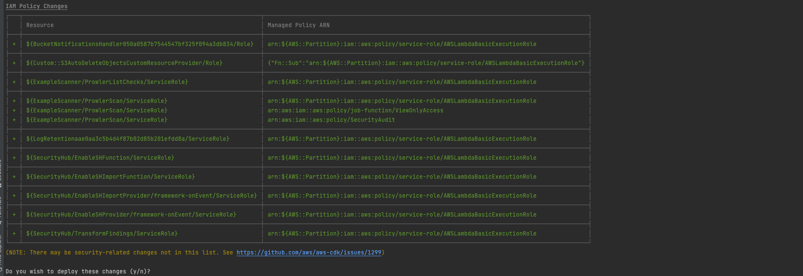
*Figure 2: Prompt to create IAM Roles*

You will see something that looks like Figure 3 when `cdk deploy` is finished:

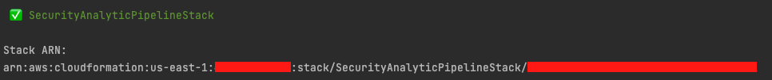
*Figure 3: Final Output of CDK*

Before continuing, Security Hub and the Prowler Scanner scan your account and process the data. While it will take less than an hour for initial data to be processed and searchable in Athena, we recommend allowing 24 hours to allow for enough data to have better visualizations.

## Building an Athena View

The following view rolls up number of findings to a given day.  Athena views can be used to summarize data, or enrich it with other sources.  

1. Paste the following SQL in the query window

   ```sql
   CREATE OR REPLACE VIEW "security-hub-rolled-up-finding" AS 
   SELECT
   "date_format"("from_iso8601_timestamp"(updatedat), '%Y-%m-%d %H:00') year_month_day
   , compliance_status
   , workflowstate
   , severity_label
   , COUNT(DISTINCT title) as cnt
   FROM
   security_hub_database."security-hub-crawled-findings"
   GROUP BY "date_format"("from_iso8601_timestamp"(updatedat), '%Y-%m-%d %H:00'), compliance_status, workflowstate, severity_label
   ```

1. Click the **Run query** button

If everything is correctly, you should see something like Figure 4.

   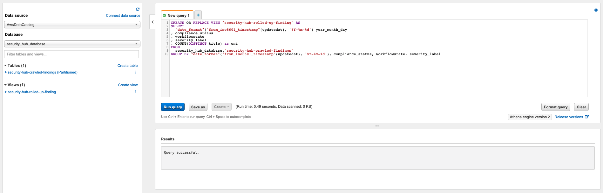
   *Figure 4: Creating an Athena View*

## Building QuickSight Visualizations

You will build your first two QuickSight visualization in this section. For simplicity, you will work a simple view. With QuickSight you can  tell rich and compelling visual stories.

In order to use QuickSight, you need to sign up for a QuickSight Subscription. Steps can be found in QuickSight's user guide at [Signing Up for an Amazon QuickSight Subscription](https://docs.aws.amazon.com/quicksight/latest/user/signing-up.html)

### Creating Data Sources in QuickSight

The first thing you need to once logging into QuickSight is to create the data source. If it is your first time logging into the service, you will be greeted with a page that looks like Figure 5.

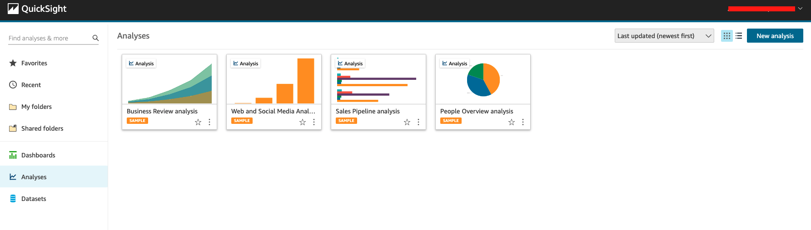
*Figure 5: Initial QuickSight Page*

1. Begin by creating a new dataset. Choose **Datasets** from the navigation pane at left. Then choose **New Dataset**.  
   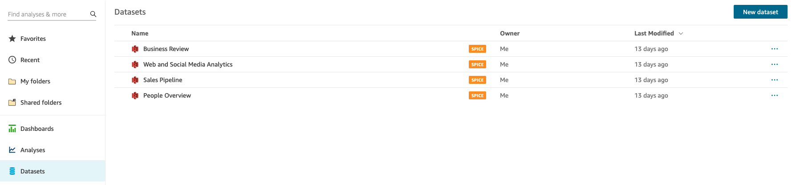
   *Figure 6: Dataset Page*
1. To create a new Athena connection profile, use the following steps:  
   a. In the FROM NEW DATA SOURCES section, choose the Athena data source card.  
   b. For **Data source name**, enter a descriptive name. For example: security-hub-rolled-up-finding.  
   c. For **Athena workgroup** choose `[ primary ]`.  
   d. Choose **Validate connection** to test the connection. This also  confirms encryption at rest.  
   e. Choose **Create data source**.  
1. On the **Choose your table** screen make the following selections:
   * **Catlog**: `AwsDataCatalog`
   * **Database**: `security_hub_database`
   * **Table**:`security-hub-rolled-up-finding`
1. Finally, select **Import to SPICE for quicker analytics** option and choose **Visualize**.

Once you are finished you will automatically be taken to the screen to create your first analysis.  Figure 7 shows an example of this screen.

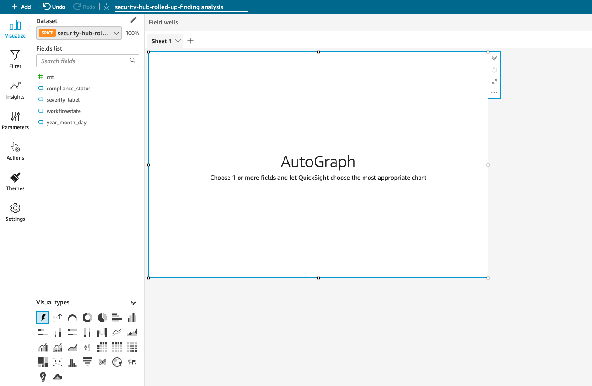
*Figure 7: Create an Analysis Screen*

### Granting Amazon QuickSight access to S3

While creating the Athena datasource will give QuickSight the ability to query data from Athena, you will also need to grant QuickSight the ability to read from S3.

1. Inside Amazon QuickSight, choose your profile name (upper right). Choose **Manage QuickSight**, and then choose **Security & permissions**.
1. Choose **Add or remove**.
1. Ensure the checkbox next to Amazon S3 is checked
1. Choose **Details**, and then choose **Selecte S3 Buckets**
1. Locate an S3 bucket in the list that starts with `securityanalyticpipelinestac` and ensure the checkbox is selected

   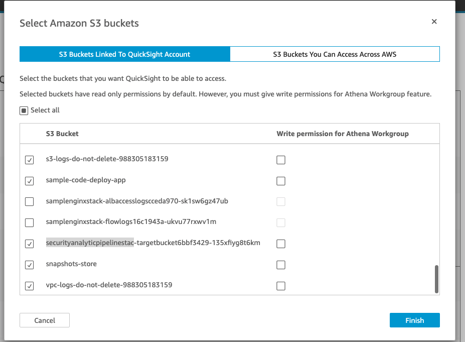
1. Choose **Finish** to save changes.

### Create an Amazon QuickSight Analysis 

A QuickSight Analysis is more than just a visualization — it helps you uncover hidden insights and trends in your data, identify key drivers, and forecast business metrics. You can create rich analytic experiences with QuickSight. For more information, visit [Working with Visuals](https://docs.aws.amazon.com/quicksight/latest/user/working-with-visuals.html) in the QuickSight User Guide. 

For simplicity, you will build a visualization that summarizes new findings discovered by severity per hour

1. Choose "Line Chart" from the **Visual Types**.  
   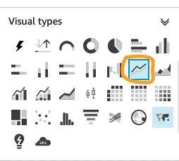  
   *Figure 8: Visual Types*

2. Select Fields.  Figure 9 shows what your field wells should look like.
   a. Locate the `year_month_day_hour` field in the field list and drag it over to the **X axis** field well.  
   b. Locate the `cnt` field in the field list and drag it over to the **Value** field well.
   c. Locate the `severity_label` field in the field list and drag it over to **Color** field well.  
   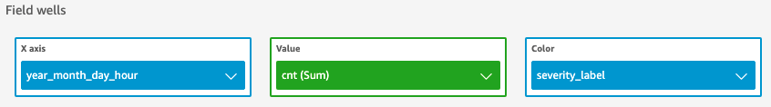
   *Figure 9: Field Wells*

3. Add Filters.  
   a. Select Filter in the left navigation panel.  
      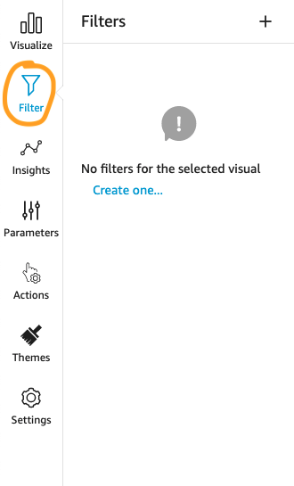  
      *Figure 10: Filters Panel*
   b. Click **Create one...** and select the `compliance_status` field.
   c. Expand the filter and uncheck `NOT_AVAILABLE` and `PASSED`.
   d. Click **Apply** to apply the filter  
   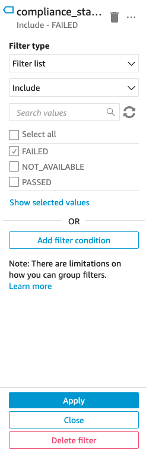  
   *Figure 11: Filtering out findings that aren't failing*

You should now see a visualization that looks like Figure 12.  
*Note: This visualization has 5 days worth of data*  
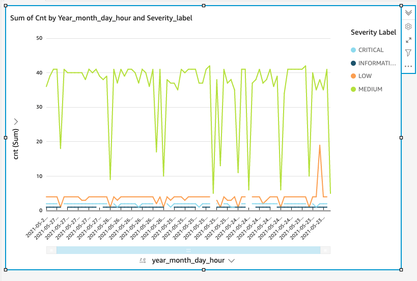  
*Figure 12: Example Visualization* 

## Encouraged Security Posture in QuickSight

Amazon QuickSight has a number of security features. While the [AWS Security](https://docs.aws.amazon.com/quicksight/latest/user/security.html) section of the Amazon QuickSight [User Guide](https://docs.aws.amazon.com/quicksight/latest/user/welcome.html) goes into detail, here is a summary that applies those standards to this scenario.

### Encryption

The findings data stored in S3 is encrypted using [AWS Key Management Service (KMS)](https://aws.amazon.com/kms/). Metadata stored in QuickSight and Athena are also encrypted at rest. Details about Athena’s encryption at rest may be found at [Encryption at Rest](https://docs.aws.amazon.com/athena/latest/ug/encryption.html) in the Athena User Guide. Similarly, details about QuickSight’s encryption at rest may be found at [Encryption at Rest](https://docs.aws.amazon.com/quicksight/latest/user/data-encryption-at-rest.html) in the QuickSight User Guide. All communication between the services uses Transport Layer Security to protect data in transit.

### Identity Management

While QuickSight enables you to manage users entirely internally, we encourage you to leverage your organization’s identity management system especially with production data. QuickSight integrates with three main providers; links to the appropriate setup guide are as follows: [AWS Identity and Access Management(IAM)](https://docs.aws.amazon.com/quicksight/latest/user/security-iam.html), [AWS Active Directory](https://docs.aws.amazon.com/quicksight/latest/user/aws-directory-service.html), and [SAML-based Single Sign-on](https://docs.aws.amazon.com/quicksight/latest/user/external-identity-providers.html). Additionally, you may also integrate [Multi-Factor Authentication](https://docs.aws.amazon.com/quicksight/latest/user/using-multi-factor-authentication-mfa.html) for an added layer of security.

## Teardown

Removing this pipeline requires clean up Quicksight, dropping the athena view, and destroying the CDK stack.  Below are detailed steps on how to clean up everything.

### Cleaning up QuickSight

1. Choose **Datasets** in the left navigation
1. Select **security-hub-rolled-up-finding** then choose **Delete dataset**
1. Confirm dataset deletion by choosing **Delete**
1. Choose **Analyses** from the left navigation
1. Choose the menu in the **security-hub-rolled-up-finding** card
   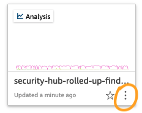  
   *Figure 13: Example Analysis Card*
1. Select **Delete** and confirm **Delete**

### Dropping the Athena View

1. Paste the following SQL in the query window

   ```SQL
   DROP VIEW "security-hub-rolled-up-finding"
   ```

1. Click the **Run query** button

### Destroying the CDK Stack

1. In your terminal run the following command. 

   ```bash
   cdk destroy
   ```

*Note:* If you experience errors, you may need to reactivate your python virtual environment by executing steps 3 - 5 of [Deploy Infrastructure using Cloud Development Kit (CDK)](#deploy-infrastructure-using-cloud-development-kit-cdk)

## Conclusion

In this post, you deployed a scalable analytic pipeline for your security tools. [AWS Security Hub](https://aws.amazon.com/security-hub/) allowed you to join and collect security findings from multiple sources. With [Amazon QuickSight](https://aws.amazon.com/quicksight/), you summarized data for your senior leaders and decision-makers to give the right amount of data in real-time. Finally, by securing QuickSight, you ensured that your sensitive data remains protected.

If you have feedback about this post, submit comments in the **Comments** section below. If you have questions about this post, start a new thread on the [AWS Security Hub forum](https://forums.aws.amazon.com/forum.jspa?forumID=283) or [contact AWS Support](https://console.aws.amazon.com/support/home)

## David Hessler

David is a Senior Cloud Consultant with AWS Professional Services. With over a decade of technical experience, he enjoys solving technical challenges and providing tailor-made solutions to customers using AWS services. He is passionate about DevOps, Security Automation, and how they work together to get customers back focusing on what matters: their mission.
